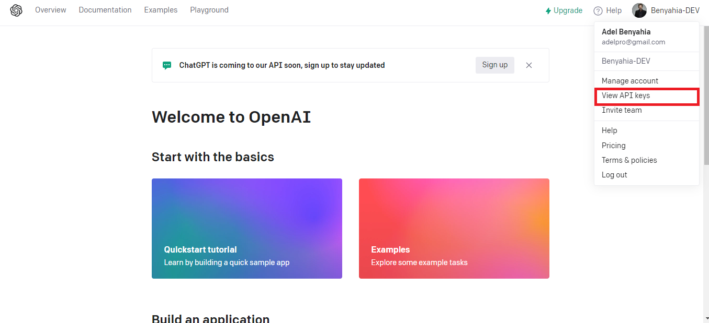
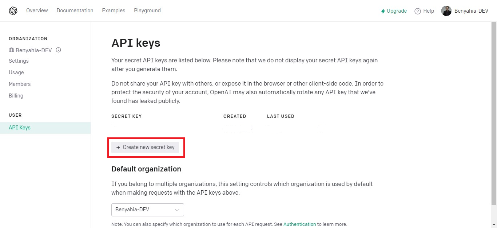
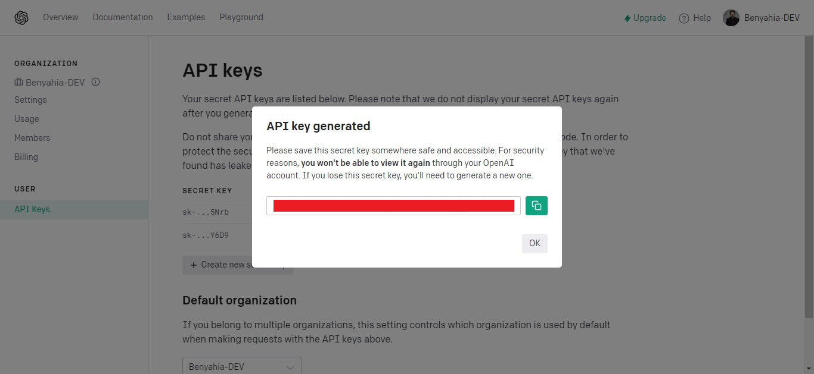

# benyahia-openAI

## About

Delve into the vast possibilities offered by the official OpenAI npm package. Discover its capabilities in generating texts, providing code completions, filtering content, and even generating images. Expand your imagination and explore the limitless potential of this cutting-edge technology.

Exploring different options of the official OpenAI npm package, including text generation, code completion, content filtering and image generation.

## Link to the official OpenAI npm package

https://www.npmjs.com/package/openai

The OpenAI Node.js library provides convenient access to the OpenAI API from Node.js applications. Most of the code in this library is generated from our OpenAPI specification.

Important note: this library is meant for server-side usage only, as using it in client-side browser code will expose your secret API key. See here for more details.

## Generate an API key from OpenAI

1. Sign in to then login to https://openai.com/api/

2. Go to View API KEYS, by clicking on the top right corner on the profile picture.



3. Click on the Create new secret key button



4. Copy the generated API key then click on the "OK" button to close the modal



## Setup

1. Create a file named `.env`.

2. Add the API KEY to the `.env` file

```bash
APIKEY="xxxx...."
```

3. Install the dependencies

You have 3 dependencies

. [Express](https://www.npmjs.com/package/express) : Fast, unopinionated, minimalist web framework for Node.js.

. [dotenv](https://www.npmjs.com/package/dotenv) : Dotenv is a zero-dependency module that loads environment variables from a .env file into process.env. Storing configuration in the environment separate from code is based on The Twelve-Factor App methodology.

. [openai](https://www.npmjs.com/package/openai) : The OpenAI Node.js library provides convenient access to the OpenAI API from Node.js applications. Most of the code in this library is generated from our OpenAPI specification.

```bash
npm install
```

Run server

```bash
npm start
```

## Usage

To access the API endpoints you have two choices:

### Text

To generate a text, send a post request to this endpoint (localhost:3500/openai/text) with a body in json format that contain two options:

**model** :
Contain the model to use, you have 3 model

. GPT-3
A set of models that can understand and generate natural language

- "text-davinci-003" Most capable GPT-3 model. Can do any task the other models can do, often with higher quality, longer output and better instruction-following. Also supports inserting completions within text.

- "text-curie-001": Very capable, but faster and lower cost than Davinci.

- "text-babbage-001": Capable of straightforward tasks, very fast, and lower cost.

- "text-ada-001": Capable of very simple tasks, usually the fastest model in the GPT-3 series, and lowest cost.

. CodexLimited beta
A set of models that can understand and generate code, including translating natural language to code

- "code-davinci-002" : Most capable Codex model. Particularly good at translating natural language to code. In addition to completing code, it also supports inserting completions within code.

- "code-cushman-001" : Almost as capable as Davinci Codex, but slightly faster. This speed advantage may make it preferable for real-time applications.

. Content filter
A fine-tuned model that can detect whether text may be sensitive or unsafe

- "content-filter-alpha"

**prompt** : contain the text to pass to openAI

## Examples

. Text generation :

- url : locahlost:3500/openai/text
- method : post
- body : {model:"text-davinci-003", promt:"write me a 90 word about nodejs"}

. Code completion :

- url : localhost:3500/openai/text
- method : post
- body : {model:"code-davinci-002", promt:"const a = 1; const b = 10; console.log"}

. Image Generation :

- url : localhost:3500/openai/image
- method : post
- body : {prompt:"Algerian desert"}

## More advanced options

. Text

In `openAIController` file, got to the function : `openAIText`

```bash
    const result = await openai.createCompletion({
      model,
      prompt,
      temperature: 0,
      max_tokens: 100,
    });
```

**max_tokens**

(integer, Optional, Defaults to 16)

The maximum number of tokens to generate in the completion.
The token count of your prompt plus max_tokens cannot exceed the model's context length. Most models have a context length of 2048 tokens (except for the newest models, which support 4096).

**temperature**

(number, Optional, Defaults to 1)

What sampling temperature to use, between 0 and 2. Higher values like 0.8 will make the output more random, while lower values like 0.2 will make it more focused and deterministic.

**n**

(integer, Optional, Defaults to 1)

How many completion to generate for each prompt.

.Image :

**n**
(integer, Optional, Defaults to 1)

How many images to generate for each prompt.

**size**

(string, optional, Default to '256x256', possible values '256x256' '512x512' '1024x1024')

The size of generated images
